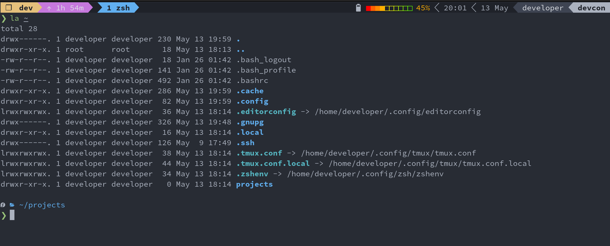

# Development Environment
A set up for a development environment centred on tmux (terminal multiplexer), zsh (shell), neovim (text editor), ranger (file manager).
Other handy utilities are also included, see requirements.txt for the packages added to an openSUSE Tumbleweed base.

## Using Distrobox
The image can be built using `./build image`.
To create the distrobox container `./build container`.

Note: `./build` is equivalent to `./build image container`.

To enter the distrobox container run `./build enter`, `distrobox enter devenv`,
or launch it from the system application launcher.

The devenv's home directory is a `devenv` directory in the host user's home directory.
The host users home directory will also be accessible if needed,
it will be mounted in the container at the same path as on the host machine.

If files from the host user's home need to be shared with the container user,
a symbolic link should be used.
For example, from inside the container run `ln --symbolic $DISTROBOX_HOST_HOME/.config/git ~/.config/`
to share git configuration.

### Troubleshooting

#### SSH
If the host is Mac OS you may need to add `IgnoreUnknown UseKeychain` to `~/.ssh/config` for SSH to work.

## WSL Install
To build the image (devenv.tar) run `./build image wsl` on a machine with `podman` installed.

Note: an openSUSE Tubleweed WSL image, which can be used for the build, is available in the Microsoft store.

The image can be imported into WSL using `wsl --import devenv (install location) (path to devenv.tar)`.

### First Run
From powershell run: `wsl --distribution devenv`,
then once inside WSL run `initial-setup` and follow the instructions.

Once the initial-setup script is complete, run `exit` to return to powershell.

Next you must terminate the WSL distribution with `wsl --terminate devenv`.

When you next enter the devenv WSL distribution it will be ready for use.

### Optional Steps
The default WSL distribution can be set to devenv using `wsl --setdefault devenv`.

If using Windows Terminal set the `command line` option in settings to
`wsl --distribution devenv tmux new-session -A -s dev` for tmux on start up.

## Include Scripts
- setup_git.sh: configure git with user info and some customisation.
- install_python_dev_tools.sh: installs common Python development tools, including recent Python versions.
- install_vscode.sh: installs VSCode inside the running distrobox and exposes it to the host.

## Miscellaneous

### Fonts
Nerd fonts are recommended to get the most from zsh theme, see [here](https://www.nerdfonts.com/).

### Terminal Colors
The setup is designed for the following terminal colors:

| Name                |       Hex |
| ------------------- | ---------:|
| background-color    |   #282C34 |
| foreground-color    |   #ABB2BF |
| black               |   #1F2229 |
| red           	    |   #E06C75 |
| green               |   #98C379 |
| yellow              |   #D19a66 |
| blue                |   #61AFEF |
| magenta             |   #C678DD |
| cyan                |   #56B6C2 |
| white               |   #ABB2BF |
| bright-black        |   #3E4452 |
| bright-red          |   #E06C75 |
| bright-green        |   #98C379 |
| bright-yellow       |   #E5C07B |
| bright-blue         |   #61AFEF |
| bright-magenta      |   #C678DD |
| bright-cyan         |   #56B6C2 |
| bright-white        |   #DDE0E5 |
